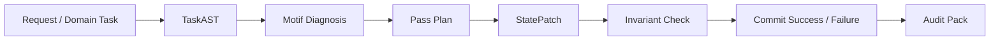

# MotifVM

MotifVM is a cognitive virtual machine for LLM agents. It converts natural-language or domain tasks into typed, inspectable state transitions, validates those transitions through invariants, commits success or failure states, and exports portable audit packs with source-bound lineage and authority references.

MotifVM is not a LangChain alternative, a RAG system, or a generic agent framework. It is a stateful reasoning runtime: a compiler-style cognitive VM and invariant-checked agent substrate.

## Kernel Equation

```text
CognitiveState + StatePatch
  -> validate patch
  -> apply transition
  -> run invariants
  -> commit success/failure
  -> export audit pack
```

No pass, tool, or LLM call mutates `CognitiveState` directly. Everything emits `StatePatch`; the runtime validates, applies, verifies, and commits.

## Architecture



## Quick Start

Run tests:

```bash
make test
```

Run the full demo suite:

```bash
make demo
```

Demo outputs are written to `.motifvm/demo_outputs/`, including audit packs and `benchmark.csv`.

Run the evaluation harness:

```bash
make eval
```

Evaluation outputs are written to `.motifvm/eval_outputs/`.

Run the adversarial harness:

```bash
make adversarial
```

Adversarial outputs are written to `.motifvm/adversarial_outputs/`, including `adversarial_results.csv` and `failure_taxonomy.json`.

Verify an exported audit pack independently:

```bash
python3 -m motifvm verify-pack .motifvm/demo_outputs/dccb_mismatch/audit_pack
```

Run the larger adversarial suite:

```bash
make adversarial-100
```

## Examples

Successful DCCB CRAR verification:

```bash
python3 -m motifvm run "Verify CRAR using examples/crar_good.csv" --domain dccb_audit
python3 -m motifvm report
```

CRAR mismatch with reconciliation patch:

```bash
python3 -m motifvm run "Verify CRAR using examples/crar_mismatch.csv" --domain dccb_audit
python3 -m motifvm export-audit 001
```

Code review auth-bypass detection:

```bash
python3 -m motifvm run-task "Review this code diff for security risk" \
  --domain code_review \
  --input examples/code_review/unsafe_auth_bypass/diff.patch
```

Repository-scale code review:

```bash
python3 -m motifvm run-task \
  "Review this repository diff for security risk" \
  --domain code_review \
  --input examples/code_review/repo_helper
```

Structured LLM call boundary with DeepSeek:

```bash
DEEPSEEK_API_KEY=... python3 -m motifvm run-task \
  "Review this code diff for security risk" \
  --domain code_review \
  --input examples/code_review/unsafe_auth_bypass/diff.patch \
  --llm deepseek
```

The API key is read from the environment and is not written to state, logs, commits, or audit packs.

Compare two committed runs:

```bash
python3 -m motifvm compare-runs 001 002
```

## Canonical Fixtures

DCCB:

- `examples/crar_good.csv`: success
- `examples/crar_mismatch.csv`: reported CRAR mismatch with reconciliation patch
- `examples/crar_below_threshold.csv`: regulatory non-compliance
- `examples/crar_missing_rwa.csv`: blocked invalid input

Code review:

- `examples/code_review/safe/diff.patch`: success
- `examples/code_review/unsafe_auth_bypass/diff.patch`: unconditional auth allow
- `examples/code_review/secret_literal/diff.patch`: obvious secret literal

## Terminal States

- `committed_success`: all error-severity invariants pass.
- `committed_failed`: one or more error-severity invariants fail, but the failed evidence state is preserved.

Failed states are first-class outputs. MotifVM preserves evidence, lineage, graph state, invariant failures, and reconciliation patches.

## Audit Pack

`motifvm export-audit <commit-id>` exports:

- `report.md`
- `state.json`
- `graph.json`
- `graph.dot`
- `graph.mmd`
- `lineage.json`
- `invariants.json`
- `inputs_manifest.json`
- `reconciliation_patch.json`
- `llm_calls.json`
- `artifacts/*.json`

Input manifest entries include SHA-256 hashes so row-level or line-level evidence remains stable even if source files change later.

Audit packs can be checked without rerunning the task:

```bash
python3 -m motifvm verify-pack <audit-pack-dir>
```

Audit packs also include `patch_timeline.json` and `patch_timeline.md`, which show each authorized or rejected StatePatch transition.

## Demo Package

The public demo package is under `demo/`:

- `demo/run_all.sh`: runs tests, canonical demos, adversarial cases, and evaluation.
- `demo/expected_results.md`: summarizes expected terminal states.
- `demo/graph_explorer/index.html`: offline audit-pack graph viewer.

Generated demo audit packs are copied to `demo/audit_packs/` and ignored by git.

## Paper Draft

See [docs/motifvm_v0_1_paper.md](docs/motifvm_v0_1_paper.md).
